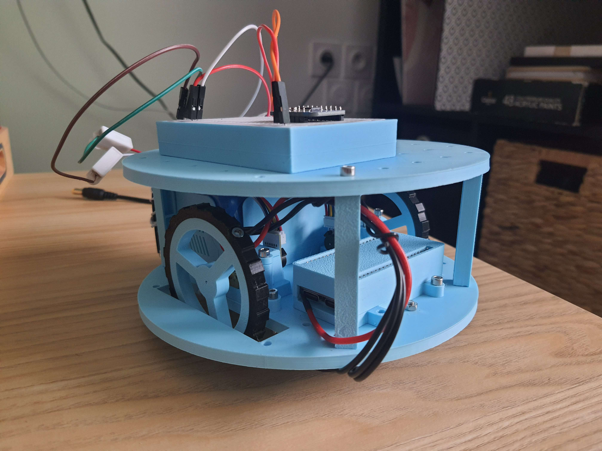
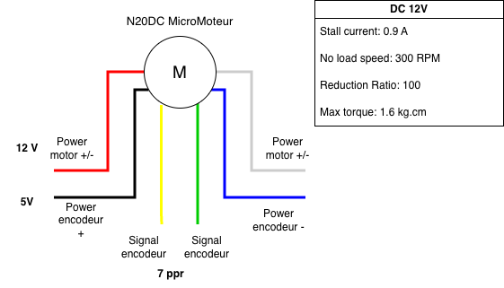

# Rampeluche

This project aims to create a two wheel bot capable of SLAM and autonomous navigation.

## Current development

Issues :  
    - Reduce torque on stall for wheel -> digs into the plastic

## Datasheets

### Motor

Micro motors in the wheels.  
    

### Microcontroller

- S3 ESP-32-S3-DevKitC-1 WROOM-1-N16R8
    [Datasheet](datasheet/esp-dev-kits-en-master-esp32s3.pdf)

### Buck convertissor

- VERTER 5V USB Buck-Boost - 500mA from 3V-5V / 1000ma from 5V-12V
    [Datasheet](datasheet/VERTER-5V-USB-Buck-Boost.pdf)

### Motor Driver

- Adafruit TB6612 1.2A DC/Stepper Motor Driver Breakout Board
    [Datasheet](datasheet/motor_driver/adafruit-tb6612-h-bridge-dc-stepper-motor-driver-breakout.pdf)
- TB6612 Chip
    [Datasheet](datasheet/motor_driver/TB6612FNG_datasheet_en_20121101.pdf)

### IMU

- Adafruit LSM9DS1 Accelerometer + Gyro + Magnetometer 9-DOF Breakout
    [Datasheet](datasheet/adafruit-lsm9ds1-accelerometer-plus-gyro-plus-magnetometer-9-dof-breakout.pdf)

### Lidar

- SLAMTEC rplidar A2M8
    [Datasheet](datasheet/LD208_SLAMTEC_rplidar_datasheet_A2M8_v2.6_en.pdf)

## CAD

3d files can be found in the cad file : Lots of models are ORP plateform based.
    [Parts](https://openroboticplatform.com/user:ColorGama)
